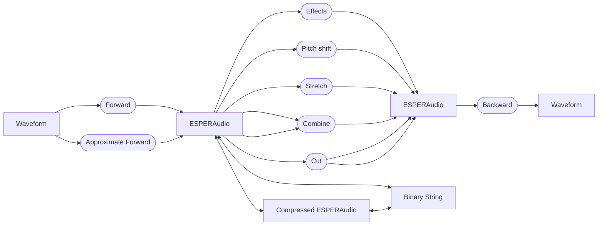

# libESPER-V2

Second version of the ESPER library for speech parametrization, modification and recovery.

## Usage

A typical workflow using ESPER consists of three steps:

- transform speech and singing waveforms to the ESPER format
- apply powerful modifications and effects enabled by the ESPER format
- transform the ESPER-formatted audio back to a waveform

Additionally, several other data paths are available, which enable libESPER-V2 to be used in a variety of more complex
applications:

## Features

TODO.

### Pitch Shifting

### Sample Stretching

### Effects

### Compression

### Others