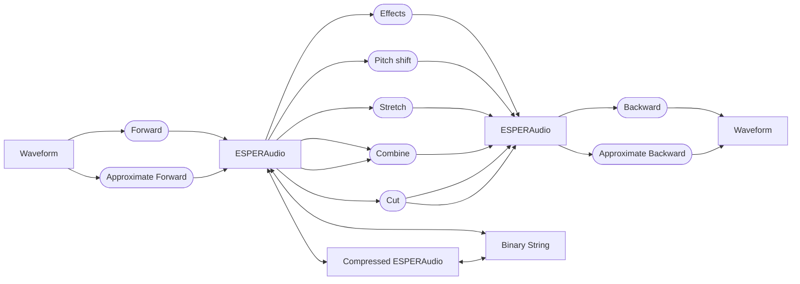

# libESPER-V2

Second version of the ESPER library for speech parametrization, modification and recovery.

ESPER stands for "enhanced separate processing of excitation and residuals"
and is, at its core, an algorithm to split audio into a voiced and unvoiced part,
and describe both parts in a specialized format.
The unique statistical properties of both part can then be used to efficiently
modify speech parameters that are hard or impossible to change in a waveform or MEL representation.
Additionally, audio in the ESPER format can be compressed to ≈1/10th of its original size with minimal loss,
and the format is well-suited for processing with AI/ML techniques.

## Overview

A typical workflow using ESPER consists of three steps:

- transform speech or singing waveforms to the ESPER format
- apply modifications and effects enabled by the ESPER format
- transform the ESPER-formatted audio back to a waveform

Additionally, several other data paths are available, which enable libESPER-V2 to be used in a variety of more complex
applications:



## Features
### Main transforms
The main features of the library are the "forward" and "backward" ESPER transforms,
which convert an audio waveform to the ESPER format and back respectively.
For both directions, an exact and faster, approximate method are available.
Additionally, the time step size and number of channels used to describe the voiced/unvoiced parts
can be chosen freely.

### Pitch detection
Part of the forward transform is a pitch detection step, which can also be run on its own.
It uses a custom, graph-based algorithm that outputs both pitch values with arbitrary time step resolution,
and annotations for the position of individual pitch periods.
If an approximate pitch is known, either as a single value for the whole sample or as a (possibly incomplete) array,
the algorithm can optionally use it as guidance.

### Pitch Shifting
One of the most interesting capabilities of libESPER-V2 is to produce natural, artifact-free pitch shifted versions of spoken audio.
The shift does not need to be uniform, audio can be shifted from any source pitch curve it has to anz target pitch curve.
Completely unvoiced sections with no determinable pitch can be handled as well.

### Sample Stretching
libESPER-V2 can stretch or compress samples in time, speeding up or slowing down the audio.
This can be done by arbitrary factors, without producing artifacts.

### Effects
libESPER-V2 also includes a collection of vocal effects, useful for a range of speech modification tasks:
- Breathiness (makes the voice either more or less breathy, and can be used to turn normal speech into whispering)
- Brightness (changes the perceived brightness of the voice by amplifying or reducing spectral peaks)
- Dynamics (mimics a speaker using more or less force/pressure to speak)
- Formant shift (simulates a shorter or longer vocal tract, changing the perceived pitch of the voice without changing the actual pitch)
- Growl (Adds a growl effect as often seen in metal singing)
- Mouth (Increases or lowers the clarity of the voice, similar to speaking more clearly, or muffled with a mostly closed mouth)
- Roughness (simulates more, or less consistent vocal chord vibrations, increasing or lowering the perceived roughness or ruggedness of the voice)

### Compression
The provided compression functions discard phase information about the voiced part, which only contains negligible information in most cases,
compresses the unvoiced part using a MEL shale with configurable resolution, and applies downsampling in time by a configurable factor.
As such, it is NOT lossless, but in practice, the losses are minimal compared to the compression ratio.

### Serialization
The library also includes function for serializing and deserializing audio data in the ESPER format to binary strings.
These strings include all metadata information required for decoding, and to ensure version compatibility.
This setup was chosed over a file parser implementation to allow developers to save several ESPER-format audio samples
as part of a single, custom file if so desired.

## Usage
Please see https://nova-vox.org/esper for a comprehensive overview of available classes, functions and best practices.

## Installation
### NuGet - recommended
libESPER-V2 is available on NuGet!

https://www.nuget.org/packages/libESPER-V2

To add it to an existing .NET8 (or later) project, open the .NET CLI and run:
```
dotnet add package libESPER-V2
```
For other build and dependency management systems, follow the instructions on the NuGet website.

### Binary package
In addition to NuGet, a ready-to-use binary package is provided with every release. They can be downloaded from the releases page.
After downloading, move the files to an appropriate location in the file structure of your target project.
Open your target project in Visual Studio, then right click on the project (not solution!) and choose

**Add > Reference...**,

then select the .DLL file. Afterwards, you can access the contents of the libESPER-V2 package by putting
```
using libESPER-V2
```
at the top of your file(s).

## Building from source
The main entry point for editing and building the project is the provided .sln file.
It is compatible with Microsoft Visual Studio 2022 or later, and JetBrains Rider 2024 or later.
(compatibility with older versions and other IDEs has not been tested.)

After loading the .sln file, you will notice it contains two projects:
- libESPER-V2, the main library project, and
- libESPER-V2.Tests, which contains the unit tests for the library.

Your IDE should automatically detect the latter as the testing project for the library.
Use the standard build, debug/release config, and test functions of the libESPER-V2 project to build and test it in different configurations.
When building, three items will be generated in your build directory:
- A directory containing the .dll of the library, and its auxillary metadata files,
- A .nupkg file, containing the NuGet package version of the library,
- A .snupkg file, containing symbol information for NuGet.

The .dll and its metadata files can then be used in the same way as the binaries downloadable from the releases page.
